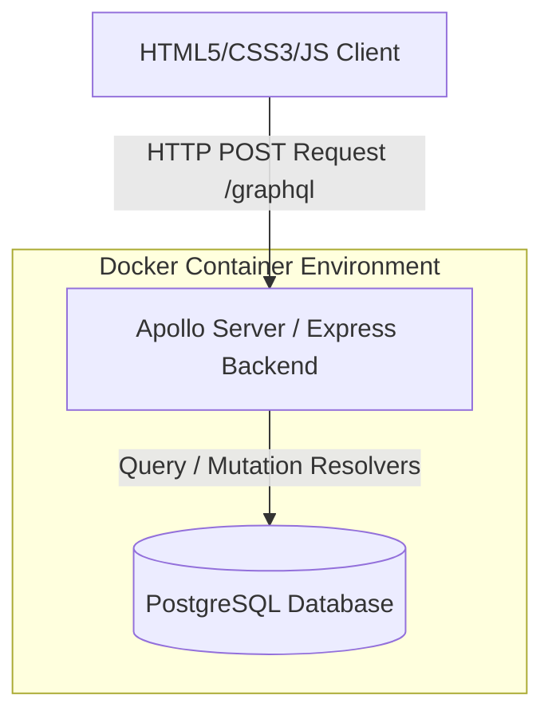
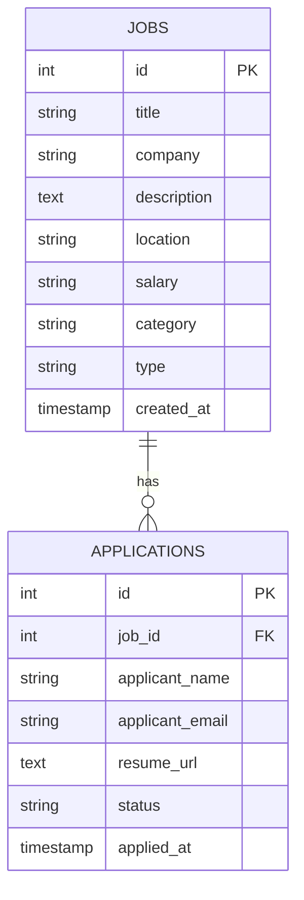

# Pembangunan Aplikasi Terintegrasi Pencarian Lowongan Kerja (Jobstreet Clone) dengan GraphQL dan Docker

Proyek ini merupakan implementasi aplikasi web pencarian lowongan kerja terintegrasi yang dibangun menggunakan **GraphQL API** (Backend), **PostgreSQL** (Database), **HTML/CSS/JS murni** (Frontend/Client), dan didukung penuh oleh kontainerisasi menggunakan **Docker** & **Docker Compose** sesuai dengan ketentuan tugas mata kuliah.

---

## 1. Arsitektur & Desain Sistem

Aplikasi ini menggunakan arsitektur modular yang membagi fungsionalitas antara Backend GraphQL dan Database, serta dihubungkan ke Frontend berbasis client-side fetch.



### Skema Database & Hubungan Data (ERD)

Tabel didesain relasional satu-ke-banyak (one-to-many) antara lowongan pekerjaan (`jobs`) dan pelamar (`applications`).



---

## 2. Struktur Folder Proyek

```
/
├── backend/
│   ├── src/
│   │   ├── db/
│   │   │   └── connection.js      # Koneksi Database pg dengan mekanisme auto-retry
│   │   ├── schema/
│   │   │   ├── index.js           # Penggabung Type Definitions
│   │   │   ├── job.js             # Skema GraphQL Pekerjaan
│   │   │   └── application.js     # Skema GraphQL Lamaran Kerja
│   │   ├── resolvers/
│   │   │   ├── index.js           # Penggabung Resolvers
│   │   │   ├── job.js             # Resolver Logika Pekerjaan
│   │   │   └── application.js     # Resolver Logika Lamaran Kerja
│   │   └── index.js               # Entry point utama Apollo Server & Express
│   ├── package.json               # Konfigurasi dependensi Node.js & modul ES
│   └── Dockerfile                 # Konfigurasi Docker Image Backend
├── client/
│   ├── index.html                 # Halaman web client utama (UI Premium)
│   ├── style.css                  # Desain visual premium (Dark Mode, Glassmorphism)
│   └── app.js                     # Logika UI & Fetching API GraphQL
├── init.sql                       # Skema database awal & seed data contoh
├── docker-compose.yml             # Orkestrator multi-kontainer Docker
└── README.md                      # Dokumentasi teknis sistem (File Ini)
```

---

## 3. Spesifikasi GraphQL API

### Query

#### A. Mengambil Daftar Lowongan Pekerjaan (`jobs`)
Dapat menyertakan filter pencarian kata kunci (`search`), lokasi (`location`), dan kategori (`category`).

* **Query:**
```graphql
query GetJobs($search: String, $location: String, $category: String) {
  jobs(search: $search, location: $location, category: $category) {
    id
    title
    company
    location
    salary
    category
    type
    createdAt
  }
}
```
* **Variables:**
```json
{
  "search": "React",
  "location": "Jakarta"
}
```

#### B. Mengambil Daftar Pelamar Kerja (`applications`)
* **Query:**
```graphql
query GetApplications($jobId: ID) {
  applications(jobId: $jobId) {
    id
    applicantName
    applicantEmail
    resumeUrl
    status
    appliedAt
    job {
      title
      company
    }
  }
}
```

---

### Mutation

#### A. Membuat Lowongan Pekerjaan Baru (`createJob`)
* **Mutation:**
```graphql
mutation CreateNewJob($input: JobInput!) {
  createJob(input: $input) {
    id
    title
    company
    location
  }
}
```
* **Variables:**
```json
{
  "input": {
    "title": "DevOps Engineer",
    "company": "GoTo Group",
    "description": "Mengelola infrastruktur cloud berbasis Kubernetes, Docker, dan CI/CD pipeline.",
    "location": "Jakarta, Indonesia",
    "salary": "Rp 18.000.000 - Rp 25.000.000",
    "category": "Teknologi Informasi",
    "type": "Full-time"
  }
}
```

#### B. Mengirimkan Lamaran Pekerjaan Baru (`applyJob`)
* **Mutation:**
```graphql
mutation SendApplication($input: ApplicationInput!) {
  applyJob(input: $input) {
    id
    status
    applicantName
  }
}
```
* **Variables:**
```json
{
  "input": {
    "jobId": "1",
    "applicantName": "Fajar Pratama",
    "applicantEmail": "fajar@example.com",
    "resumeUrl": "https://drive.google.com/cv-fajar.pdf"
  }
}
```

#### C. Mengubah Status Lamaran Pekerjaan (`updateApplicationStatus`)
Status yang valid: `'Pending'`, `'Interview'`, `'Rejected'`, `'Accepted'`.

* **Mutation:**
```graphql
mutation UpdateStatus($id: ID!, $status: String!) {
  updateApplicationStatus(id: $id, status: $status) {
    id
    status
  }
}
```
* **Variables:**
```json
{
  "id": "1",
  "status": "Interview"
}
```

---

## 4. Cara Menjalankan Aplikasi

Pastikan Anda telah memasang **Docker Desktop** di komputer Anda.

### Langkah 1: Jalankan Kontainer (Docker Compose)
Buka terminal pada direktori proyek utama (`C:\TUBES IAE`) dan jalankan perintah berikut:
```bash
docker-compose up --build
```
Perintah ini akan secara otomatis:
1. Mengunduh base image `node` & `postgres`.
2. Membuat database PostgreSQL dan mengimpor skema dari `init.sql`.
3. Membangun container backend Node.js dan mengunduh seluruh dependensi NPM.
4. Menjalankan backend server pada port `4000`.

### Langkah 2: Buka GraphQL Playground / Postman
Setelah server berjalan, Anda dapat mengakses GraphQL Playground untuk mencoba query dan mutation secara interaktif:
* Buka browser dan kunjuhgi: `http://localhost:4000/graphql`

### Langkah 3: Buka Halaman Web Client (Frontend)
Untuk mencoba antarmuka pengguna pencari kerja dan rekruter:
1. Buka folder `client` pada komputer Anda.
2. Klik ganda file `index.html` untuk membukanya secara langsung di browser favorit Anda.
3. Anda siap mencoba fitur pencarian kerja, melamar pekerjaan, memposting pekerjaan baru, serta mengubah status pelamar secara interaktif!
